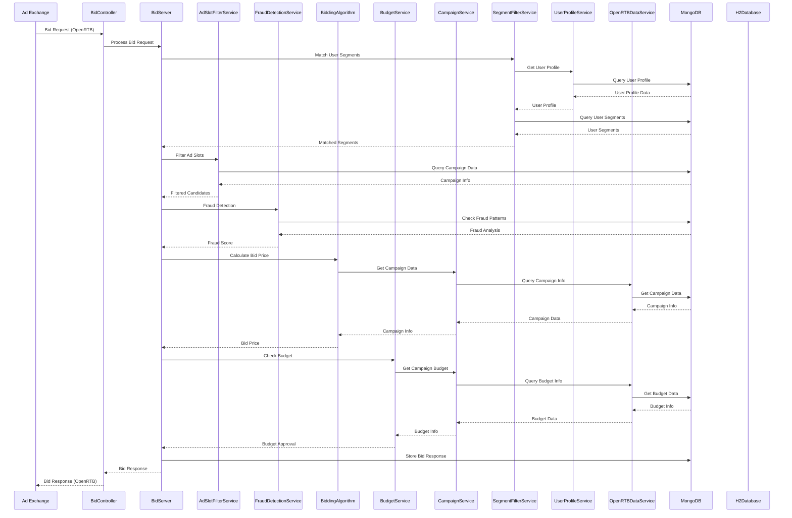
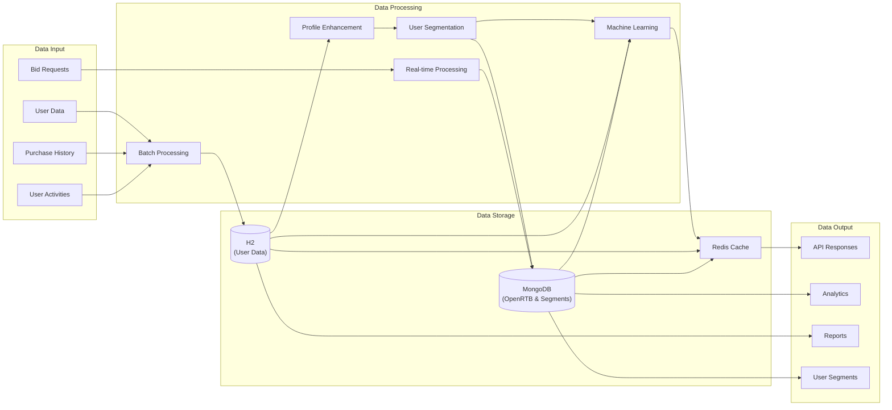
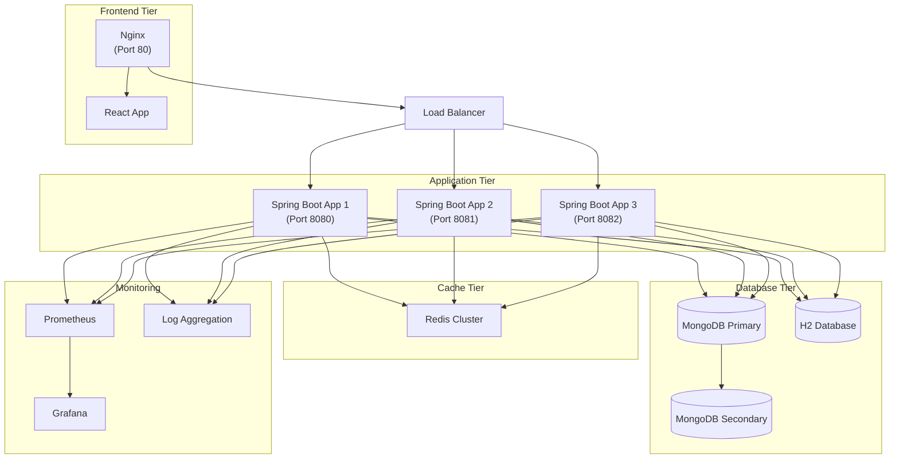

# 项目架构图

本文档包含了Spring Boot OpenRTB API项目的完整架构图，使用Mermaid语法生成。

## 整体系统架构

```mermaid
graph TB
    %% 外部系统
    Client["客户端/前端应用"]
    ADX["Ad Exchange/SSP"]
    DSP["DSP平台"]
    
    %% API网关层
    subgraph "API Gateway Layer"
        NGINX["Nginx (Port 80)"]
        API["Spring Boot API (Port 8080)"]
    end
    
    %% 应用层
    subgraph "Application Layer"
        direction TB
        
        %% 用户管理模块
        subgraph "Users Module"
            UC["UserController"]
            UPC["UserProfileController"]
            ATC["ActivityTrackController"]
            PHC["PurchaseHistoryController"]
        end
        
        %% 用户画像和分段模块
        subgraph "User Segmentation Module"
            UPFC["UserProfileController (MongoDB)"]
            USC["UserSegmentController"]
            USMC["UserSegmentMappingController"]
        end
        
        %% 广告竞价模块
        subgraph "Ads Module"
            BC["BidController"]
        end
    end
    
    %% 服务层
    subgraph "Service Layer"
        direction TB
        
        %% 用户服务
        subgraph "User Services"
            US["UserService"]
            UPS["UserProfileService"]
            ATS["ActivityTrackService"]
            PHS["PurchaseHistoryService"]
        end
        
        %% 用户画像和分段服务
        subgraph "User Segmentation Services"
            UPFS["UserProfileService (MongoDB)"]
            USS["UserSegmentService"]
            USMS["UserSegmentMappingService"]
            SFS["SegmentFilterService"]
        end
        
        %% 广告服务
        subgraph "Ad Services"
            BS["BidServer"]
            BA["BiddingAlgorithm"]
            ASF["AdSlotFilterService"]
            FDS["FraudDetectionService"]
            BUS["BudgetService"]
            CS["CampaignService"]
        end
    end
    
    %% 领域层
    subgraph "Domain Layer"
        direction TB
        
        %% 用户领域模型
        subgraph "User Domain"
            UD["User"]
            UPD["UserProfile"]
            ATD["ActivityTrack"]
            PHD["PurchaseHistory"]
        end
        
        %% 用户画像和分段领域模型
        subgraph "User Segmentation Domain"
            UPFD["UserProfileEntity (MongoDB)"]
            USD["UserSegmentEntity"]
            USMD["UserSegmentMappingEntity"]
            SRD["SegmentRule"]
        end
        
        %% 广告领域模型
        subgraph "Ads Domain"
            BR["BidRequest"]
            BRE["BidResponse"]
            IMP["Impression"]
            DEV["Device"]
            USR["User (OpenRTB)"]
            BC_MODEL["BidCandidate"]
        end
    end
    
    %% 基础设施层
    subgraph "Infrastructure Layer"
        direction TB
        
        %% 用户数据访问
        subgraph "User Repositories"
            UR["UserRepository"]
            UPR["UserProfileRepository"]
            ATR["ActivityTrackRepository"]
            PHR["PurchaseHistoryRepository"]
        end
        
        %% 用户画像和分段数据访问
        subgraph "User Segmentation Repositories"
            UPFR["UserProfileRepository (MongoDB)"]
            USR_SEG["UserSegmentRepository"]
            USMR["UserSegmentMappingRepository"]
        end
        
        %% 广告数据访问
        subgraph "Ads Repositories"
            BRR["BidRequestRepository"]
            BRRE["BidResponseRepository"]
            CR["CampaignRepository"]
            IR["InventoryRepository"]
            BSR["BidStatisticsRepository"]
        end
        
        %% 数据服务
        subgraph "Data Services"
            ORDS["OpenRTBDataService"]
            URS["UserRepositoryService"]
        end
    end
    
    %% 数据库层
    subgraph "Database Layer"
        MONGO[("MongoDB\n(OpenRTB Data)")]
        H2[("H2 Database\n(User Data)")]
    end
    
    %% 配置和工具
    subgraph "Configuration & Utils"
        CONFIG["Configuration"]
        SCHEDULER["BudgetCleanupScheduler"]
        ASPECT["UserAccessLogAspect"]
    end
    
    %% 连接关系
    Client --> NGINX
    ADX --> API
    DSP --> API
    NGINX --> API
    
    API --> UC
    API --> UPC
    API --> ATC
    API --> PHC
    API --> BC
    API --> UPFC
    API --> USC
    API --> USMC
    
    UC --> US
    UPC --> UPS
    ATC --> ATS
    PHC --> PHS
    BC --> BS
    UPFC --> UPFS
    USC --> USS
    USMC --> USMS
    
    US --> UR
    UPS --> UPR
    ATS --> ATR
    PHS --> PHR
    
    %% 用户画像和分段服务连接
    UPFS --> UPFR
    USS --> USR_SEG
    USMS --> USMR
    SFS --> UPFS
    SFS --> USS
    SFS --> USMS
    
    %% H2到MongoDB的数据转存流程
    UPS --> UPFS
    US --> UPFS
    
    BS --> BA
    BS --> ASF
    BS --> FDS
    BS --> BUS
    BS --> SFS
    
    BA --> CS
    BA --> SFS
    ASF --> CR
    FDS --> BSR
    BUS --> CS
    
    CS --> ORDS
    ORDS --> BRR
    ORDS --> CR
    ORDS --> IR
    ORDS --> BSR
    
    UR --> H2
    UPR --> H2
    ATR --> H2
    PHR --> H2
    
    %% 用户画像和分段数据存储到MongoDB
    UPFR --> MONGO
    USR_SEG --> MONGO
    USMR --> MONGO
    
    BRR --> MONGO
    BRRE --> MONGO
    CR --> MONGO
    IR --> MONGO
    BSR --> MONGO
    
    ORDS --> MONGO
    URS --> H2
    
    SCHEDULER --> BUS
    ASPECT --> US
    
    classDef controller fill:#e1f5fe
    classDef service fill:#f3e5f5
    classDef domain fill:#e8f5e8
    classDef repository fill:#fff3e0
    classDef database fill:#ffebee
    classDef external fill:#f5f5f5
    
    class UC,UPC,ATC,PHC,BC,UPFC,USC,USMC controller
    class US,UPS,ATS,PHS,BS,BA,ASF,FDS,BUS,CS,UPFS,USS,USMS,SFS service
    class UD,UPD,ATD,PHD,BR,BRE,IMP,DEV,USR,BC_MODEL,UPFD,USD,USMD,SRD domain
    class UR,UPR,ATR,PHR,BRR,BRRE,CR,IR,BSR,UPFR,USR_SEG,USMR repository
    class MONGO,H2 database
    class Client,ADX,DSP,NGINX external
```

## OpenRTB竞价流程架构

## 数据流架构

## 部署架构

## 技术栈

### 后端技术栈
- **框架**: Spring Boot 3.x
- **数据库**: MongoDB (OpenRTB数据), H2 (用户数据)
- **缓存**: Redis
- **构建工具**: Maven
- **容器化**: Docker + Docker Compose

### 前端技术栈
- **框架**: React 19.x
- **构建工具**: npm
- **Web服务器**: Nginx
- **测试**: Playwright

### 开发工具
- **API文档**: OpenAPI 3.0 (Swagger)
- **监控**: Prometheus + Grafana
- **日志**: SLF4J + Logback
- **测试**: JUnit 5, Mockito

## 如何查看架构图

1. **在线查看**: 将Mermaid代码复制到 [Mermaid Live Editor](https://mermaid.live/) 中查看
2. **VS Code**: 安装Mermaid Preview插件
3. **GitHub**: GitHub原生支持Mermaid图表渲染
4. **其他工具**: 
   - [Draw.io](https://app.diagrams.net/) (支持Mermaid导入)
   - [Typora](https://typora.io/) (Markdown编辑器，支持Mermaid)
   - [Obsidian](https://obsidian.md/) (知识管理工具，支持Mermaid)

## 架构特点

### 1. 分层架构 (Layered Architecture)
- **接口层**: Controllers处理HTTP请求
- **应用层**: Services处理业务逻辑
- **领域层**: Domain Models定义核心业务实体
- **基础设施层**: Repositories处理数据访问

### 2. 模块化设计
- **用户模块**: 处理用户管理、画像、活动跟踪
- **用户画像和分段模块**: 处理用户画像构建、用户分段、分段过滤、数据转存
- **广告模块**: 处理OpenRTB竞价、预算控制、反欺诈、广告活动管理

### 3. 微服务就绪
- 清晰的模块边界
- 独立的数据存储
- RESTful API设计

### 4. 高性能设计
- 异步处理
- 缓存策略
- 数据库优化
- 负载均衡

### 5. 可观测性
- 全面的日志记录
- 性能监控
- 健康检查
- 错误追踪